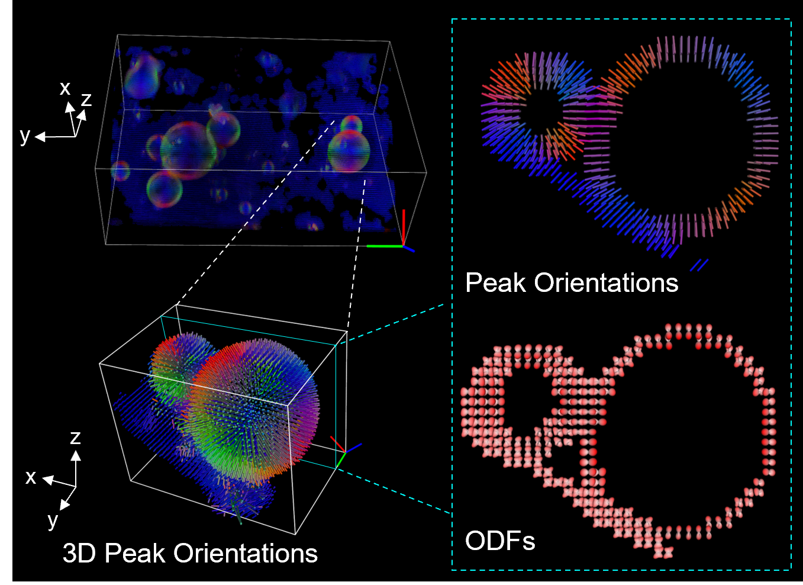

# A package for spatio-angular imaging under polarized fluorescence microscopy: simulation, reconstruction and rendering (PFM-tool)

PFM-tool is a 3D spatio-angular reconstruction pipeline for polarized fluorescence microscopy, incoperating:

- Optimized spatio-angular imaging model
- CPU-/GPU-based efficient generalized Richarson-Lucy algorithm (eGRL) to restore density and orientation distribution
  in each voxel
- Visualization module for rendering density, orientation or ODF map.

This is the companion code to our paper:

[Observing biological spatio-angular structures and dynamics with statistical image reconstruction and polarized fluorescence microscopy]().

## System Requirements

### Tested Environment

eGRL pipeline for reconstructing GUV dataset based on GPU:

    - Windows 10 PRO 22H2
    - Python 3.9
    - NVIDIA GeForce RTX 4090 24GB
    - CUDA 12.8 and cuDNN 7.6.5

### Installation

- Create an anaconda environment `PFM-tool`. This will take ~5 minutes.

        cd PFM-tool
        conda env create -f environment-windows.yml

- Activate the `PFM-tool` environment. You will need to activate this environment
  every time you want to run polaris.

      conda activate PFM-tool

- Install `PFM-tool` locally so that you can access it from anywhere.

      pip install -e ./

### Package Organization

Please read the document [PACKAGE_ORGANIZATION.md](./PACKAGE_ORGANIZATION.md).

## Overall Workflow

### Dataset for test

Example experimental datasets for model training and prediction are available
at [Dropbox](https://www.dropbox.com/scl/fo/4wa95ces3jwg5u8h8r8pe/AIraJ1CCuLcLE-Jyb2Aue7o?rlkey=dnpb69jzj4aox7k1up7kyki6g&st=2jaz9f2c&dl=0).

| Dataset                   | Fluorescent dye        | Excitation | Polarization state                      | Expected orientation |
|---------------------------|------------------------|------------|-----------------------------------------|----------------------|
| Giant Unilamellar Vesicle | FM1-43                 | 488 nm     | Scheme 0: full combinations, 42 volumes | Normal to membrane   |
| Tobacco xylem cell        | Pontamine fast scarlet | 561 nm     | Scheme 0: full combinations, 42 volumes | Along the ribs       |

Notes:

- Acquired via pol-diSPIM with a pair of 1.1 and 0.67 NA objectives.
- Voxel size (preprocessed): 0.13×0.13×0.13 μm.

### Practice on test data

Here we provide a brief guidance on running the code on the following experimental data.

- **Test on Giant Unilamellar Vesicle (GUV) data**

    1) Download the GUV data `20200116_GUV_tiltLS`
       from [Dropbox](https://www.dropbox.com/scl/fo/4wa95ces3jwg5u8h8r8pe/AIraJ1CCuLcLE-Jyb2Aue7o?rlkey=dnpb69jzj4aox7k1up7kyki6g&st=2jaz9f2c&dl=0),
       and then place the downloaded folder `20200116_GUV_tiltLS` into directory `./examples/test_data/`.

    2) Open the code `recon_GUV.py`. Users can use the default data paths, or set their own as needed at Line 36. Then
       choose one of the 4 provided ROI at Line 40-44.

    3) Run the code `recon_GUV.py` within Python Interpreter `PFM-tool`. Wait for the reconstruction and rendering, then
       the peak orientation distribution will be displayed in the pop-up `FURY 0.7.1` window.

    4) Optional: modify the following parameters at Line 107 for displaying at different modalities (density,
       orientation or ODF) or filtering masks for better observation:

       | Parameter    | Description                                                   | Example Values                        |
               |--------------|---------------------------------------------------------------|---------------------------------------|
       | `viz_type`   | Display modality: density, orientation or ODF                 | `['Density']`,`['Peak']` or `['ODF']` |
       | `mask`       | Apply density-related mask for filtering                      | `spang0.density() > 0.05`, ...        |
       | `skip_n`     | Voxel sampling rate for rendering                             | `1`, `2`, ...                         |
       | `peak_scale` | Scale the length of cylinders which indicate the orientations | `1`, `2`, ...                         |

- **Test on Tobacco xylem cell data**

    1) Download the GUV data `20200322_XylemCell_FullCalibration`
       from [Dropbox](https://www.dropbox.com/scl/fo/4wa95ces3jwg5u8h8r8pe/AIraJ1CCuLcLE-Jyb2Aue7o?rlkey=dnpb69jzj4aox7k1up7kyki6g&st=2jaz9f2c&dl=0),
       and then place the downloaded folder `20200322_XylemCell_FullCalibration` into directory `./examples/test_data/`.

    2) Open the code `recon_Xylem.py`. Users can use the default data paths, or set their own as needed at Line 36.

    3) Run the code `recon_Xylem.py` within Python Interpreter `PFM-tool`. Wait for the reconstruction and rendering,
       then
       the peak orientation distribution will be displayed in the pop-up `FURY 0.7.1` window.

    4) Optional: modify the following parameters at Line 107 for displaying at different modalities (density,
       orientation or ODF) or filtering masks:

       | Parameter    | Description                                                   | Example Values                        |
               |--------------|---------------------------------------------------------------|---------------------------------------|
       | `viz_type`   | Display modality: density, orientation or ODF                 | `['Density']`,`['Peak']` or `['ODF']` |
       | `mask`       | Apply density-related mask for filtering                      | `spang0.density() > 0.05`, ...        |
       | `skip_n`     | Voxel sampling rate for rendering                             | `1`, `2`, ...                         |
       | `peak_scale` | Scale the length of cylinders which indicate the orientations | `1`, `2`, ...                         |

## Acknowledgement

The rendering codes are cloned and modified from [polaris](https://github.com/talonchandler/polaris).